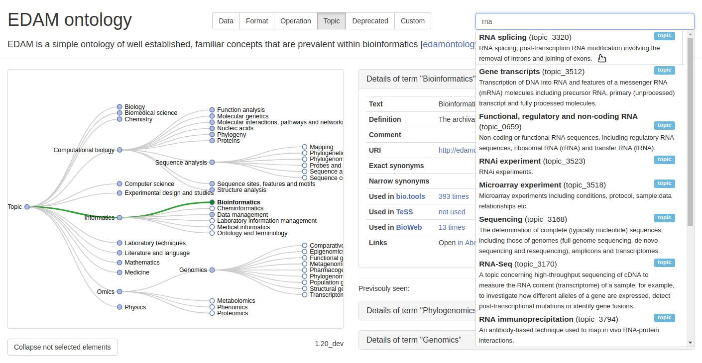

# EDAM stand-alone browser using D3.js

The EDAM Browser is a client-side web-based visualization javascript widget. Its goals are to help annotating bioscientific resources and services with EDAM, and to facilitate and foster community contributions to EDAM.

## Use it ...

### ... online

Go to https://edamontology.github.io/edam-browser/

---
### ... locally

1. Download/clone the repository

2. Change to working directory : `cd edam-browser`

##### Option 1: *You need node.js and npm*
 - `npm install`
 - `npm run dev`

##### Option 2: *You need Python3*
Run `python3 -m http.server 20080` . It starts a web server allowing you to browse EDAM on localhost:20080.

##### Option 3:
- Open Visual Studio Code extensions explorer, and search for [Live Server](https://marketplace.visualstudio.com/items?itemName=ritwickdey.LiveServer)
- Install the "Liver Server" extension
- With the index.html file open in the editor, right-click and select "Open with Live Server" to launch EDAM browser on [http://127.0.0.1:5500](http://127.0.0.1:5500) in your default web browser
---

### ... with a custom ontology

EDAM Browser can render ontology described in JSON following the [schema](ontology.schema.json); see [here](https://github.com/edamontology/edam-browser/blob/main/paper.md#criteria-6) for more information on how to load a custom ontology.

## Third-party integration

### Demo

A demo showing you how to add the tree visualization and how you can interact with the it programmatically is available at https://edamontology.github.io/edam-browser/demo.html

### Dependencies

The EDAM Browser relies on D3.js 4.13.0, JQuery 3.2.1, JQuery UI 1.12.1, Boostrap 3.3.7, and Font Awesome 5.6.0
