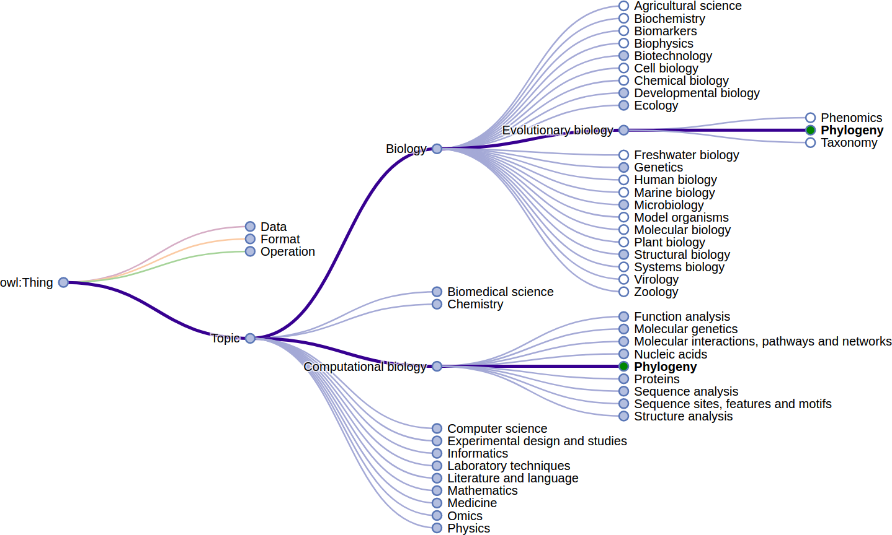
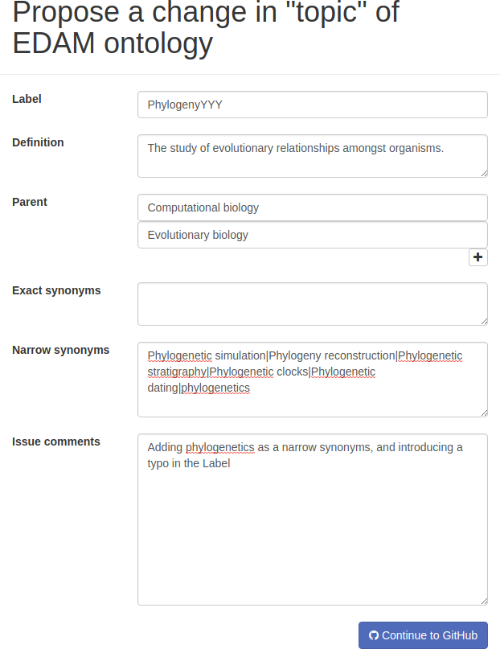
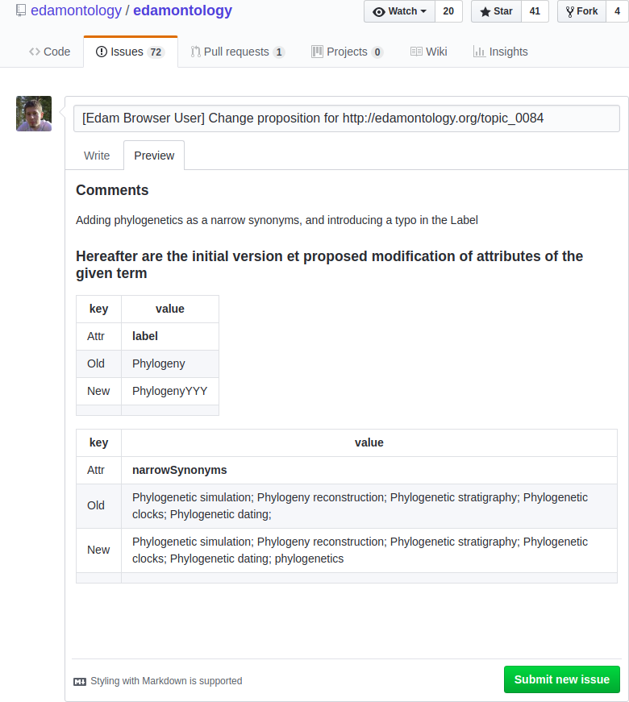
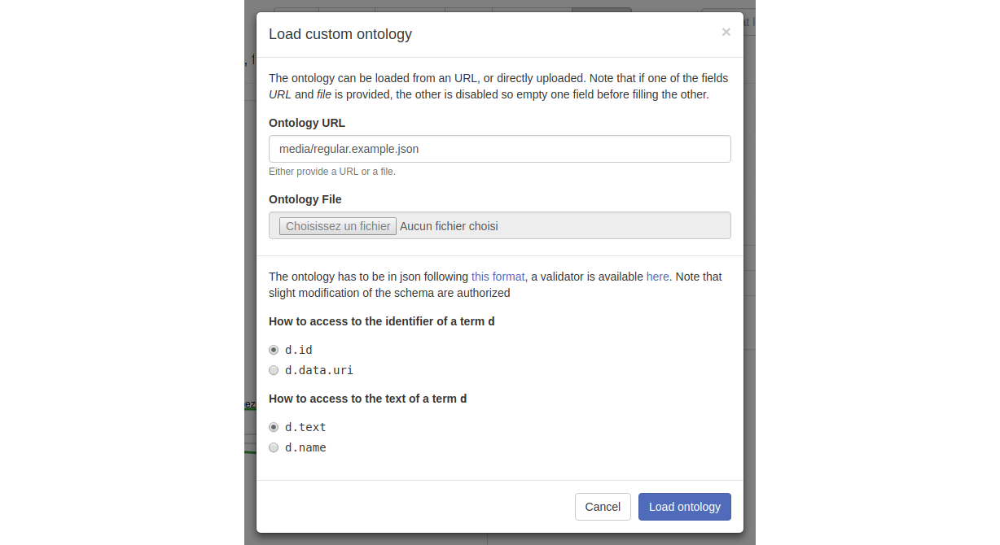

# Summary

## Abstract

Labelling, indexing and describing a Bioinformatics resource, whether it is a software, a database, or a service is of a great help when it comes to promoting it to various user communities. As an example, the ELIXIR bio.tools [@ison2015tools] registry contains more than ten thousands software and service entries. In this context, the use of controlled vocabularies to describe the resources is of a paramount importance. This need is addressed by the EDAM Ontology [@ison2013edam] which proposes a controlled vocabulary hierarchically organized around four concepts which are types of data, formats, operations and topics.

We here present the EDAM Browser, a client-side web-based visualization javascript widget to help describing resources, and to facilitate and foster community contributions to EDAM. More precisely, (i) we review related work and features that need to be addressed; (ii) we describe how these features are addressed by the EDAM Browser; finally (iii) we discuss its reusability.

## Related work

We collected from EDAM users and authors features that a browser should have to fit their needs. Hereafter we describe collected criteria and their presence or absence in the following platforms: (i) BioPortal[@whetzel2011bioportal], (ii) OLS - Ontology Lookup Service[@jupp2015new], (iii)  WebProt&eacute;g&eacute;[@tudorache2013webprotege] and (iv) AberOWL[@hoehndorf2015aber].

| id  | Feature                                | AberOWL          | BioPortal| OLS              | WebProtégé       |
|:---:|----------------------------------------|:-------------------:|:-----------:|:-------------------:|:-------------------:|
| 1   | EDAM is present                        | ✔                   | ✔           | ✔                   | ✘                   |
| 2   | Publicly available                     | ✔                   | ✔           | ✔                   | registration        |
| 3   | Handle multiple parents                | ✘                   | ✘           | ✔                   | ✘                   |
| 4   | Can be integrated in external websites | ✘                   | ✔           | ✔                   | ✘                   |
| 5   | Facilitate community contribution      | ✘                   | limited     | ✘                   | ✘                   |
| 6   | Use edited version of EDAM             | ✘                   | ✘           | ✘                   | ✔                   |
| 7   | Local installation                     | ✔ (w/ admin rights) | ✔ (as a VM) | ✔ (w/ admin rights) | ✔ (w/ admin rights) |


##### Criteria 1 and 2

On the one hand the AberOWL, BioPortal and OLS platforms integrate EDAM and let unauthenticated users browse it. On the other hand WebProt&eacute;g&eacute; is meant for ontology edition, and asks users to register before uploading its ontology. 

##### Criteria 3 "Handle multiple parents"

The EDAM ontology, while being represented as a tree is a directed acyclic graph, meaning that a term can have more than one parent. When searching for the Topic "Phylogeny", [OLS](https://www.ebi.ac.uk/ols/ontologies/edam/terms?iri=http%3A%2F%2Fedamontology.org%2Ftopic_0084) indicates that the term has multiple parents both in the tree representation and the details. Other platforms, i.e. [AberOWL](http://aber-owl.net/ontology/EDAM/#/Browse/<http%3A%2F%2Fedamontology.org%2Ftopic_0084>), [BioPortal](http://bioportal.bioontology.org/ontologies/EDAM/?p=classes&conceptid=http%3A%2F%2Fedamontology.org%2Ftopic_0084), and  WebProt&eacute;g&eacute;, display the term at only one position in the tree while the details tab indicates that the term is a _subClassOf_ two terms. 

##### Criteria 4 "Can be integrated in external websites"

Bioportal allows to integrate [widgets](http://bioportal.bioontology.org/ontologies/EDAM/?p=widgets) such as autocomplete form, graph visualization, and tree visualization. Widgets for OLS can be found in [biojs](http://biojs.io) registry. Neither AberOWL nor WebProtégé propose widgets.  

##### Criteria 5 "Facilitate community contributions"

AberOWL indicates the homepage of the ontology. 
BioPortal provides a custom suggestion and bug report mechanism that lets users provide feedback on the contents of the ontology. However, this mechanism, being generic to all ontologies, is not deeply integrated with the development forge used by each ontology. 
OLS provides only the possibility to contact the authors through email. 
WebProtégé proposes to download the edited ontology in OWL format, it is then the responsibility of the user to transmit this edited version to the ontology authors.

##### Criteria 6 "Use edited version of EDAM"

Beyond the regular official releases of the EDAM ontology, the "in-developement" version cannot be browsed with AberOWL, BioPortal nor OLS without a manual and public submission. The publication of submitted releases is usually processed within a few hours.
WebProtégé allows to upload any ontology, and within seconds it is possible to browse and edit it.

##### Criteria 7 "Local installation"

AberOWL can locally be [installed](https://github.com/bio-ontology-research-group/aberowl-meta), software requirements includes Redis, nodejs, npm, Groovy and Apache2.
BioPortal is available as a [virtual appliance](https://www.bioontology.org/wiki/index.php/Category:NCBO_Virtual_Appliance).
Installing locally OLS is [possible](https://www.ebi.ac.uk/ols/docs/installation-guide), software requirements includes Maven, Neo4J, MongoDB, Tomcat, Solr.
WebProtégé can also be [installed](https://protegewiki.stanford.edu/wiki/WebProtegeAdminGuide) among with MongoDB and Tomcat.

In all cases, these systems requires privileged (administrator-level) permissions to install them.

## Main functionalities

In this section, we present how each feature of the previous section are addressed by the EDAM Browser.

##### Criteria 1 and 2

The EDAM Browser is publicly available (criteria 1) and does not require authentication (criteria 2). 

##### Criteria 3

Multiple parents are handled (see for [instance](https://ifb-elixirfr.github.io/edam-browser/#topic_0084)). In order to improve readability when a term is selected (1) all the term's positions are shown; and (2) all paths from the root node are highlighted.



##### Criteria 4

The ability to integrate the EDAM Browser, and its tree representation is major requirement, in order to help third party websites promoting their resources when labeled with EDAM. Both the autocomplete input field and the tree visualization are re-usable. To highlight this statement we propose a dynamic [demo](https://ifb-elixirfr.github.io/edam-browser/demo.html) showing how it can be integrated, how the user can  interact with the tree, and how to programmaticaly interact with the tree in JavaScript. 

##### Criteria 5

Letting users contribute to the ontology improves acceptance by the community as a user propose changes to the ontology to fit his/her needs. By contribution, we mean correction of definitions, proposition of new synonyms, or even new terms. The EDAM Browser gives access to a form letting the user propose the changes and then format his/her changes in a github issue ready to be submitted by the user. 





##### Criteria 6

Using the EDAM Browser to explore an custom ontology is possible, the ontology should be in the following simplified schema which is expressed in [json schema](http://json-schema.org/). A complete version of the schema is accessible [here](https://ifb-elixirfr.github.io/edam-browser/ontology.schema.json) and an example file is [there](https://ifb-elixirfr.github.io/edam-browser/media/regular.example.json). 

<!--- https://app.quicktype.io/#l=schema helps generating schema--->

```json
{
    "$ref": "#/definitions/EDAMBrowserTerm",
    "definitions": {
        "EDAMBrowserTerm": {
            "type": "object",
            "additionalProperties": true,
            "properties": {
                "id": {
                    "type": "string"
                },
                "text": {
                    "type": "string"
                },
                "description": {
                    "type": "string"
                },
                "children": {
                    "type": "array",
                    "items": {
                        "$ref": "#/definitions/EDAMBrowserTerm"
                    }
                }
            },
            "required": [
                "id",
                "text"
            ],
            "title": "EDAMBrowserTerm"
        }
    }
}
```

The user opens the EDAM Browser and click on the button labelled _Custom_ at the top of it interface. Then a form is opened where the user either provide the url where the ontology file can be found, or the file, and also indicate how identifier and text can be accessed in the file.



Filling this form with the url of the example file and indicating that the identifier is accessible with `d.id` will (i) open the given file and (ii) change the url such that this configuration can be bookmarked and reopen later : [resulting link](https://ifb-elixirfr.github.io/edam-browser/?url=https%3A%2F%2Fraw.githubusercontent.com%2FIFB-ElixirFr%2Fedam-browser%2Fmaster%2Fmedia%2Fregular.example.json&identifier_accessor=d.id&text_accessor=d.text#p9&custom_url).

##### Criteria 7

The EDAM Browser can easily be downloaded and run on a personal computer. The user either open index.html and then chose to load an ontology, or starts a local web server using `python start_edam_stand_alone_browser.py` and the ontology will automatically be loaded (recommended scenario).
Once downloaded, the user can also use a custom version of the ontology, including beta version of the next release or a whole new ontology. By default, ontology should be in the [json schema](http://json-schema.org/) presented previously, but the browser can be configured to use a different schema (c.f: hereafter). A validator is available [here](https://jsonschemalint.com/).

## Reusability

The tree-based visualization of the EDAM Browser uses [d3.js](https://d3js.org/) v3 [@d3js]. In order to make the tree re-usable we used [Javascript Closures](http://jibbering.com/faq/notes/closures/) following 
[Towards Updatable D3.js Charts](https://www.toptal.com/d3-js/towards-reusable-d3-js-charts)  and
[Towards Reusable Charts](https://bost.ocks.org/mike/chart/). It allows us to create encapsulated charts which are easily customizable. 

The following example comes from the demo and shows how to visualize the ontology at `media/topic_extended.biotools.min.json` in the div `#tree` with the `Bioinformatics` term initially selected. Note that as the format of the file does not follow the recommendation, we have to provide a new method to access the identifier.

```javascript
my_tree = interactive_tree()
    //overriding as the identifier by default consider d.id
    .identifierAccessor(function(d){return d.data.uri;})
    .debug(true)           //debug enabled
    .duration(1000)        //animation duration is set to 1s
    .tooltipEnabled(true)  //tooltip will be shown chen hovering elements 
    //at first Bioinformatics should be selected
    .initiallySelectedElementHandler(function(d){
        return d.data.uri==="http://edamontology.org/topic_0091"
    })
    //call the demo (next step you see) when the tree have been loaded
    .loadingDoneHandler(demo)
;
// pre-draw/build chart in div
d3.select("#tree").call(my_tree);
//indicated where the data can be found
my_tree.data_url("media/topic_extended.biotools.min.json");
```


## Conclusion

We here presented the EDAM Browser, which allows users to browse this ontology, and resource owners to easily display the terms used to label the resource. We enumerated seven major features and showed that state of the art web based ontology browsers do not provide all of them while EDAM Browser does. Finally we described how it can be easily re-used in any third part website.

# References
